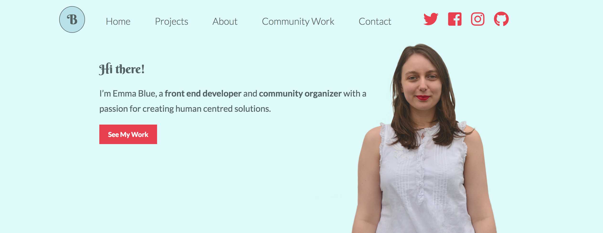

# Emma Blue's Portfolio 

 

My portfolio site for design and development. 

## Features

* Portfolio Feature Section
* Logo Animation Demo Reel 

## Getting Started

### Prerequisites

To locally host this website, you’ll need Git installed on your computer.
[See detailed install instructions here.](https://gist.github.com/derhuerst/1b15ff4652a867391f03)

### Installing

From the command line:

```# Initialize git

$ git init

# Clone this repository

$ git clone https://github.com/EmmaBlue/Blue_E_Portfolio.git

# Go into the repository

$ cd Blue_E_Portfolio

# Install node modules

$ npm install 

```

And you’re done!

## Built With

* [CSS Grid](https://cssreference.io/css-grid/)
* [CSS Flexbox](https://cssreference.io/flexbox/)  
* [Javascript](https://www.javascript.com/) - Used for lightboxes 

## Authors

* [**Emma Blue**](https://github.com/EmmaBlue) - *Developer and Designer*

## License

This project is licensed under the [MIT License](https://opensource.org/licenses/MIT/).
